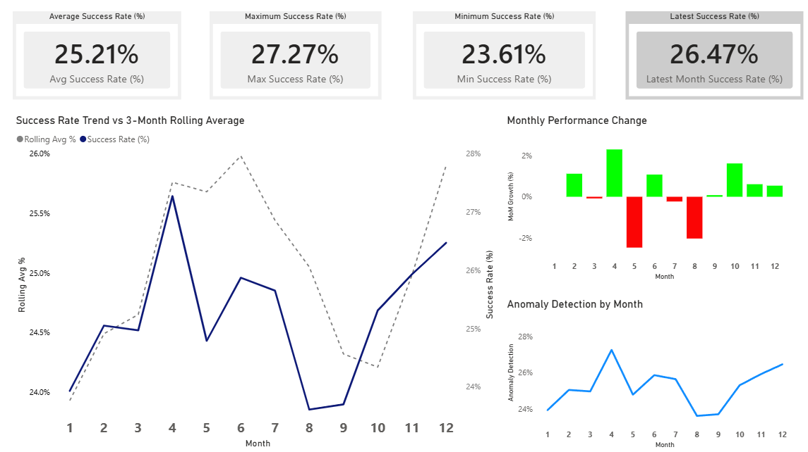

# End-to-End Sales Performance Analysis (SQL + Power BI)

## Project Overview
This project analyzes monthly sales performance using SQL and Power BI to evaluate sales effectiveness, detect volatility, and support strategic decision-making.

The analysis focuses on identifying performance trends, momentum shifts, and anomaly patterns across monthly sales data.

---

## Business Questions
- How does the monthly sales success rate change over time?
- Are we improving or declining month-over-month?
- Are sales results meeting the expected target?
- Are there unusual spikes or drops that require attention?

---

## Dataset
- Source: Simulated sales transaction data
- Table: `orders`
- Key columns:
  - `sales_date`
  - `status` (Success / Failed)
  - `total_sales`

---

## Tools & Skills Used
- SQL (SQLite)
- Common Table Expressions (CTE)
- Window Functions:
  - `LAG ()`
  - `AVG() OVER`
- Business Metrics:
  - Success Rate
  - Month-over-Month Growth
  - Rolling Average (3 months)

---

## Analysis Summary
- Calculated **monthly success rate**
- Analyzed **month-over-month growth**
- Applied **rolling average** to smooth trends
- Classified performance trends:
  - Increase
  - Stable
  - Decrease
- Identified anomalies such as sudden spikes or drops

---

## Key Insights
- Sales performance shows fluctuations across months
- Rolling averages help identify underlying trends
- Month-over-month growth highlights performance momentum
- Certain periods require deeper investigation due to abnormal changes

---

## Business Interpretation
- Inconsistent success rates indicate potential inefficiencies in sales execution.
- Declining periods may reflect operational gaps or external market pressure.
- Recovery phases suggest that corrective strategies may be effective.
- Continuous monitoring is required to minimize volatility and improve predictability.
  
## Repository Structure
sql-sales-performance-analysis/
│
├── data/
│   └── sales_data.db
│
├── sql/
│   ├── 01_monthly_success_rate.sql
│   ├── 02_mom_growth_analysis.sql
│   ├── 03_rolling_average_trend.sql
│   └── 04_anomaly_detection.sql
│
├── dashboard/
│   ├── sales_performance_dashboard.pbix
│   └── dashboard_preview.png
│
└── README.md

---

## Power BI Dashboard

The following visualizations were built in Power BI to monitor sales performance trends and detect volatility patterns.

### 1. Full Dashboard Overview

This dashboard summarizes KPI performance, growth momentum, rolling trends, and anomaly signals in a single analytical view.

### 2. Success Rate Trend vs 3-Month Rolling Average

This visualization compares actual monthly success rate against a 3-month rolling average to identify performance consistency and volatility.

### 3. Monthly Growth & Anomaly Detection

This section highlights month-over-month growth fluctuations and detects abnormal performance patterns requiring further investigation.

---

## Technical Highlights
- Implemented rolling window calculations using `AVG() OVER (ROWS BETWEEN 2 PRECEDING AND CURRENT ROW)`
- Used `LAG()` to calculate month-over-month performance shifts
- Designed anomaly flag logic based on performance deviation
- Structured modular SQL scripts for analytical scalability

---

## Conclusion
This analysis demonstrates how SQL can be used to translate raw transaction data into meaningful business insights.  
The results provide a foundation for performance monitoring, decision-making, and further analytical exploration.

---

## How to Run
- Database: SQLite
- Open the database using DB Browser for SQLite
- Run each SQL file in order:
  1. 01_monthly_success_rate.sql
  2. 02_mom_growth_analysis.sql
  3. 03_rolling_average_trend.sql
  4. 04_anomaly_detection.sql
